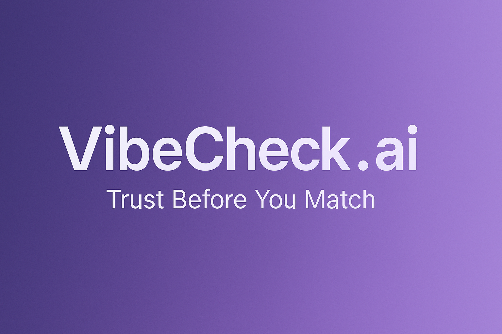
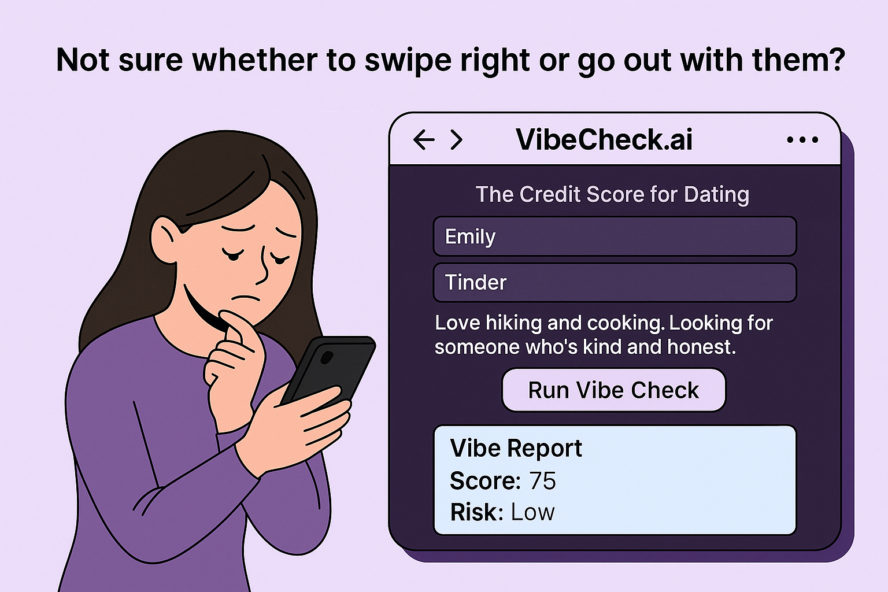

# 💜 VibeCheck.ai — Trust Before You Match

> **Safer Dating Starts with Blockchain-Powered AI.**  
> Verify dating or social profiles before you talk to them — powered by **Solana x402 micropayments** and **AI-driven credibility scoring**.

---

## 🚨 Problem
Online dating is broken — fake profiles, scams, ghost accounts, and zero accountability.  
People swipe based on vibes — not verified truth.

---

## 💡 Solution
VibeCheck.ai introduces a **trust layer for modern relationships**:  
- Paste a profile → get an **AI “Vibe Report”** (score + risk + insights)  
- Unlock with a **Solana x402 micropayment**  
- 100% transparent and privacy-safe  

---

## ⚙️ Built With
- 🟣 Next.js + TypeScript  
- 🟣 Solana x402 + USDC SPL Payments  
- 🟣 Phantom Wallet Integration  
- 🟣 Real-time Search API (ready for agent)  

---

## 🔮 Future Vision
📸 Upload dating profile screenshots → auto-extract via OCR  
🤖 AI LLM-powered vibe summaries  
🧩 SDK for dating apps to embed “Verify Before You Match”  
🌐 On-chain trust scores for social credibility networks  

---

## 🖼️ IRL Scenes

---

## 🚀 Live Demo
👉 [**vibecheck-x402.vercel.app**](https://vibecheck-x402-q8gc.vercel.app/)
[Public API endpoint](https://vibecheck-x402-q8gc.vercel.app/api/check)

---

**Built with 💜 by Anubha, Fatume & Harsh**  
Empowering safer digital connections — one vibe at a time.

